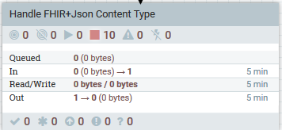
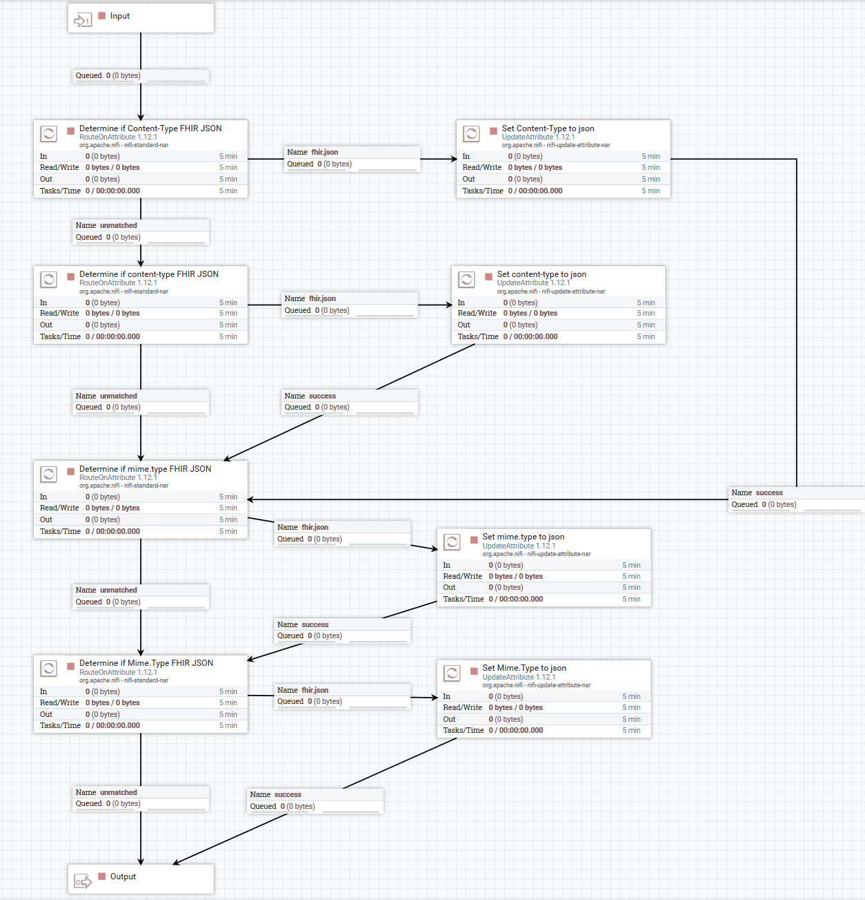

# Handle FHIR Content Type
When handling the content type being received from the FHIR server, the type needs to be converted from FHIR+JSON to json to be able to be viewed in the NIFI canvas.

### Main Processor Group

### Flow Details

### Reference 
